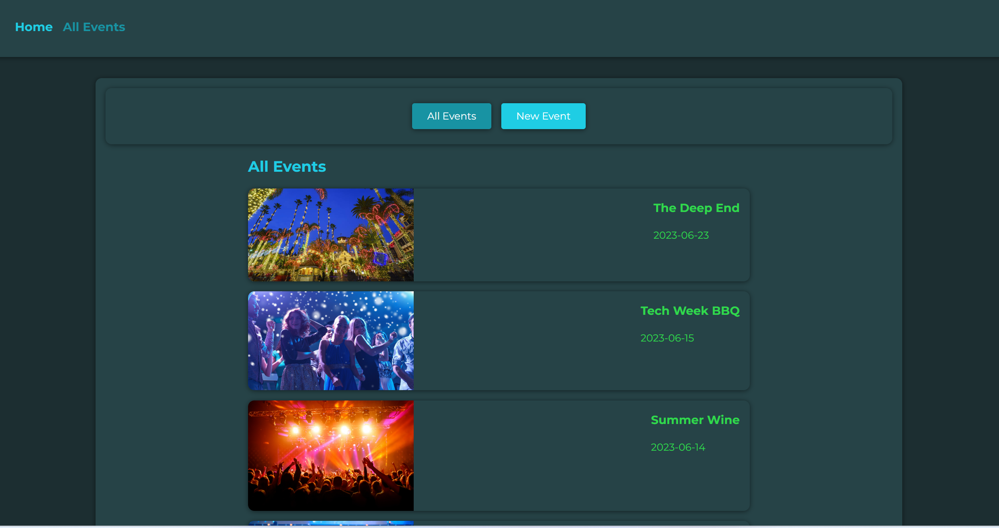
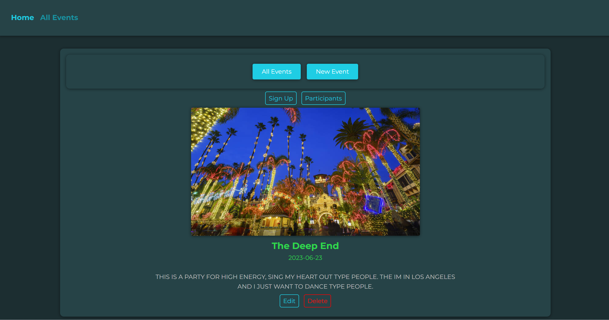
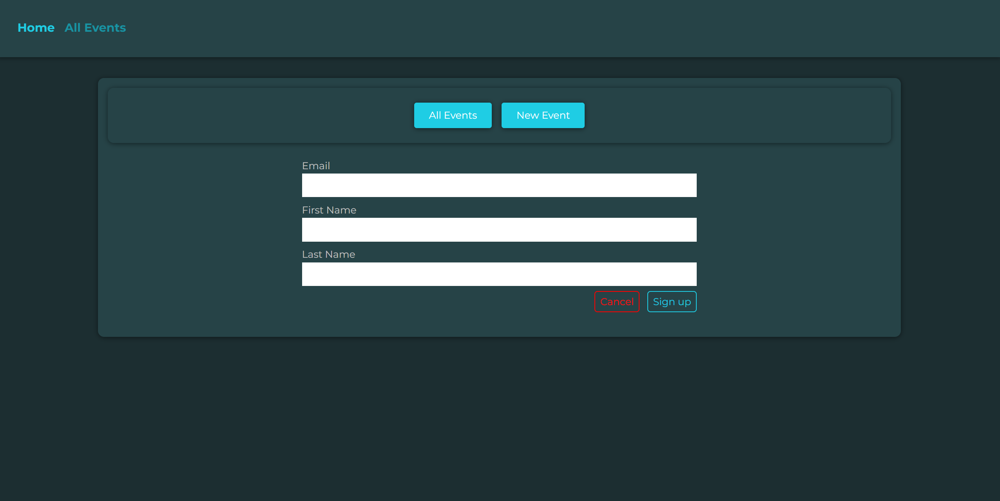
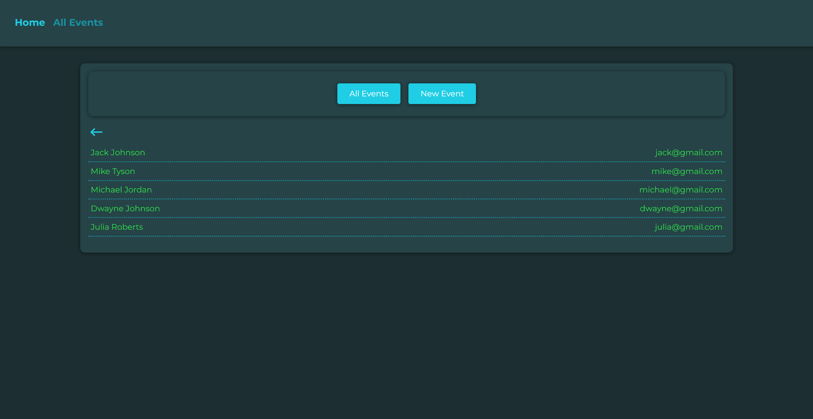

# Events

## Description
This is a website where the user can create, update, delete an event, or sign up for an event. 

## Technologies Used
- HTML
- CSS
- JavaScript (ES6)
- React
- React-Router
- Firebase db

## Usage
Use the 'All Events' button to see all events. Click on the event to see details about the event. Click the 'Sign Up' button to sign up for an event. Click the 'Participants' button to see the participants. Click the 'Edit' or 'Delete' buttons to edit or delete the event.

### Go to [Events](https://armanbarseghyan83.github.io/events/)

Home page

All events

Event details

Sign up

Participants

## Questions
### Use the links below if you have any questions.
- Email Address - [armanbarseghyan83@gmail.com](mailto:armanbarseghyan83@gmail.com)
- Linkedin - [https://www.linkedin.com/in/arman-barseghyan](https://www.linkedin.com/in/arman-barseghyan)
- GitHub Profile - [https://github.com/ArmanBarseghyan83](https://github.com/ArmanBarseghyan83)